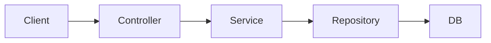
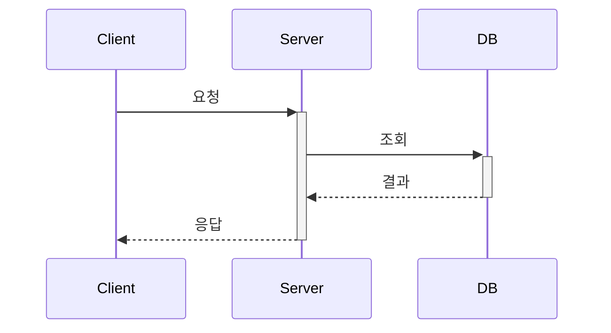
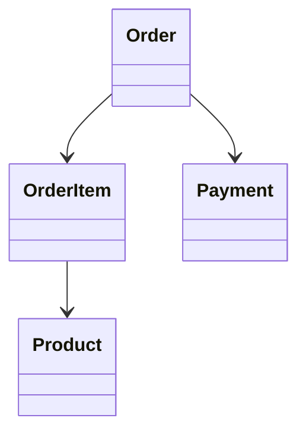

# 블로그 글 작성 가이드

> "매일 조금씩, 개발 기록" - 본질을 담은 글쓰기

---

## 나만의 글 톤

### 핵심 정체성
- 백엔드 개발자가 **실무에서 부딪힌 문제**를 기록하는 블로그
- 화려한 수식어 없이, **겪은 그대로** 담백하게
- "이렇게 하세요"가 아니라 "저는 이렇게 했습니다"

### 피해야 할 AI스러운 표현
```
❌ "이 글에서는 ~에 대해 자세히 알아보겠습니다"
❌ "~는 매우 중요한 개념입니다"
❌ "결론적으로 말씀드리자면"
❌ "다양한", "효과적인", "효율적인" (뜻 없는 형용사)
❌ "~할 수 있습니다" 반복
❌ 모든 문단 끝에 "~입니다" 연속

✅ 직접적으로, 군더더기 없이
✅ 내가 실제로 쓰는 말투로
✅ 한 문장에 하나의 정보만
```

### 글의 색깔을 만드는 요소

**1. 솔직한 실패 인정**
```
❌ "최적의 방법을 찾았습니다"
✅ "처음엔 완전히 잘못 짚었습니다"
✅ "3일 삽질 끝에 알게 된 건 허무할 정도로 단순했습니다"
```

**2. 구체적인 숫자와 맥락**
```
❌ "성능이 크게 개선되었습니다"
✅ "850ms → 120ms. 체감이 확 달랐습니다"
```

**3. 생각의 흐름을 보여주기**
```
❌ "A 방식을 선택했습니다"
✅ "A와 B 중 고민했습니다. A는 ~라서 좋지만 ~가 걸렸고,
   B는 ~라서 결국 A로 갔습니다"
```

**4. 짧은 문장, 여백**
```
❌ 빽빽하게 이어지는 장문
✅ 문장 사이에 숨 쉴 틈을 줍니다
✅ 한 문단이 5문장을 넘기면 끊습니다
```

### 자주 쓰는 표현 (나만의 패턴)
```
도입:
- "~를 적용하면서 겪은 일입니다"
- "왜 이렇게 동작하는지 궁금했습니다"

전개:
- "먼저 상황을 정리하면"
- "문제는 여기서 시작됐습니다"
- "확인해보니"

전환:
- "그런데"
- "여기서 의문이 생겼습니다"
- "결국"

마무리:
- "정리하면"
- "다음에는 ~를 다뤄보겠습니다"
```

### 피해야 할 것
- 모든 걸 설명하려는 욕심
- 독자를 가르치려는 태도
- 검색 유입을 위한 키워드 나열
- "~해야 합니다", "~하면 안 됩니다" 같은 훈계
- **경험 과장, 감정 부풀리기**

### 팩트 중심 글쓰기
```
❌ "정말 힘들었습니다"
❌ "엄청난 삽질 끝에"
❌ "드디어 해결했습니다!"
❌ "완벽하게 동작했습니다"

✅ "2시간 정도 걸렸습니다"
✅ "로그를 보니 원인은 단순했습니다"
✅ "해결은 됐는데, 더 나은 방법이 있을 수도 있습니다"
```

**원칙: 겪은 것만, 아는 것만**
- 안 해본 건 안 해봤다고
- 확실하지 않으면 "~인 것 같습니다" 대신 "확인이 필요합니다"
- 추측과 사실을 구분해서 표기

```
❌ "이 방법이 best practice입니다"
✅ "공식 문서에서는 이 방법을 권장합니다"
✅ "저는 이렇게 했는데, 다른 방법도 있을 겁니다"
```

### 지향하는 것
- 동료 개발자에게 슬랙으로 설명하듯
- 내가 나중에 다시 봐도 이해할 수 있게
- 핵심만, 빠르게

---

## 글쓰기 철학

### 1. 왜(Why)를 먼저 씁니다
```
❌ "@Transactional은 이렇게 사용합니다"
✅ "왜 @Transactional이 필요할까요? 트랜잭션 없이 발생하는 문제부터 살펴보겠습니다"
```

### 2. 과거의 나에게 설명합니다
- 6개월 전의 내가 읽어도 이해할 수 있는가?
- 어떤 배경 지식이 필요한지 명시했는가?

### 3. 삽질 과정을 숨기지 않습니다
```
❌ "정답은 이것입니다"
✅ "처음에는 A를 시도했지만 실패했고, B를 적용해보니 이런 문제가 있었습니다. 결국 C가 답이었습니다"
```

### 4. 정량적 데이터를 활용합니다
```
❌ "성능이 개선되었습니다"
✅ "응답 시간이 평균 850ms에서 120ms로 약 85% 개선되었습니다"

❌ "쿼리가 많이 줄었습니다"
✅ "쿼리 수가 N+1(101회)에서 2회로 감소했습니다"
```

---

## 말투와 문체

### 기본 원칙
- **합니다체** 사용 (전문적이면서도 읽기 편한 문체)
- 명확하고 간결하게, 불필요한 수식어 제거

### 말투 예시
```
❌ ~한다. ~이다. (논문체, 딱딱함)
❌ ~해요. ~이에요. (캐주얼, 가벼움)
❌ ~함. ~임. (메모체, 불친절)

✅ ~합니다. ~입니다. (합니다체)
✅ ~했습니다. ~되었습니다. (경험 서술)
✅ ~하겠습니다. ~살펴보겠습니다. (설명 전개)
```

### 좋은 예시
```
❌ "@Transactional 어노테이션은 메서드에 트랜잭션을 적용한다."
✅ "@Transactional을 붙이면 메서드 전체가 하나의 트랜잭션으로 묶입니다."

❌ "이 문제는 N+1 문제이다."
✅ "이 현상이 바로 N+1 문제입니다."

❌ "해결 방법은 다음과 같다."
✅ "다음과 같이 해결했습니다."
```

### 전문적인 서술 패턴
```
- "이 글에서는 ~를 다루겠습니다"
- "먼저 ~부터 살펴보겠습니다"
- "~라는 문제가 있었습니다"
- "이를 해결하기 위해 ~를 적용했습니다"
- "결과적으로 ~가 개선되었습니다"
- "정리하면 다음과 같습니다"
```

---

## 문장 작성 규칙

### 1. 한 문장은 짧게 (40자 이내)
```
❌ "Spring의 @Transactional 어노테이션은 메서드나 클래스에 선언하면
   해당 범위 내의 모든 데이터베이스 작업을 하나의 트랜잭션으로 묶어주는
   기능을 제공하는데, 이때 프록시 기반으로 동작하기 때문에 주의할 점이 있다."

✅ "@Transactional은 메서드를 하나의 트랜잭션으로 묶어줍니다.
   프록시 기반으로 동작하기 때문에 주의할 점이 있습니다."
```

### 2. 능동태로 씁니다
```
❌ "트랜잭션이 시작된다" (수동)
✅ "Spring이 트랜잭션을 시작합니다" (능동)

❌ "예외가 발생되면 롤백된다"
✅ "예외가 발생하면 Spring이 롤백합니다"
```

### 3. 불필요한 표현 제거
```
❌ "기본적으로", "일반적으로", "보통의 경우에는"
✅ 그냥 바로 본론으로

❌ "~라고 할 수 있다", "~라고 볼 수 있다"
✅ "~입니다", "~합니다"

❌ "~하는 것이 좋다", "~해야 한다"
✅ "~하세요", "~합니다"
```

---

## 문단 구성

### 1. 한 문단 = 한 가지 주제
```
❌ (한 문단에 여러 주제)
@Transactional은 프록시로 동작합니다. 그래서 같은 클래스 내부 호출은
트랜잭션이 적용되지 않습니다. 참고로 readOnly 옵션을 주면 성능이
좋아지는데, 이건 flush를 생략하기 때문입니다.

✅ (주제별로 분리)
## 프록시 동작 방식
@Transactional은 프록시로 동작합니다.
그래서 같은 클래스 내부 호출은 트랜잭션이 적용되지 않습니다.

## readOnly 옵션
readOnly 옵션을 주면 성능이 좋아집니다.
flush를 생략하기 때문입니다.
```

### 2. 문단 길이: 3~5문장
- 너무 짧으면: 산만해 보임
- 너무 길면: 읽기 힘듦

### 3. 문단 사이 연결
```
✅ 좋은 연결 표현:
- "그런데 여기서 문제가 있습니다."
- "그렇다면 어떻게 해야 할까요?"
- "이를 해결하기 위해..."
- "실제로 적용해보면..."
- "여기서 중요한 점은..."
```

### 4. 시각적 구분 활용
```markdown
## 큰 주제 (H2)
설명 문단

### 세부 주제 (H3)
설명 문단

**강조할 내용**은 볼드로

- 나열할 때는
- 리스트를 활용합니다

> 인용이나 강조할 문장은 blockquote로
```

---

## 글 구조 템플릿

### 기술 개념 글

```markdown
## 들어가며
- 이 글에서 다룰 내용 소개
- 독자가 얻을 수 있는 것

## 배경
- 이 기술이 왜 등장했는가?
- 어떤 문제를 해결하려 하는가?

## 핵심 원리
- 내부적으로 어떻게 동작하는가?
- 핵심 개념 설명

## 적용 방법
- 실제 사용 예시
- 코드와 함께 설명

## 주의할 점
- 흔한 실수
- 안티 패턴

## 정리
- 핵심 포인트 요약
```

### 문제 해결 글

```markdown
## 들어가며
- 어떤 문제를 해결했는지 한 줄 요약

## 도메인 설명
- 시스템/서비스 배경 설명
- 독자가 맥락을 이해할 수 있도록

## 문제 정의
- 구체적인 문제 상황
- 정량적 데이터 (응답 시간, 에러율 등)
- 문제의 영향도

## 원인 분석
- 왜 이런 문제가 발생했는가?
- 디버깅/분석 과정

## 해결 방법
- 검토한 선택지들
- 최종 선택과 그 이유
- 구현 내용

## 결과
- 개선된 지표 (정량적)
- Before/After 비교

## 정리
- 배운 점
- 앞으로 주의할 점
```

### 아키텍처/설계 글

```markdown
## 들어가며
- 무엇을 설계했는지 소개

## 배경
- 어떤 요구사항이 있었는가?
- 기존 구조의 문제점

## 선택지 분석
### 방법 A
- 장점
- 단점

### 방법 B
- 장점
- 단점

## 최종 설계
- 선택한 방법과 이유
- 트레이드오프 설명
- 전체 구조 (다이어그램)

## 구현
- 핵심 코드
- 주요 결정 사항

## 결과와 회고
- 잘된 점
- 아쉬운 점
- 향후 개선 방향
```

---

## 도입부 작성법

### 3문장 공식
1. **문제/상황 제시**: 독자가 공감할 수 있는 상황
2. **핵심 질문**: 이 글에서 다룰 내용
3. **해결 예고**: 이 글을 읽으면 얻을 것

### 예시
```markdown
## 들어가며

JPA를 사용하다 보면 쿼리가 예상보다 많이 발생하는 경험을 하게 됩니다.
1번만 조회했는데 왜 쿼리가 100번 나가는 걸까요?
이 글에서는 N+1 문제의 원인과 해결 방법을 정리하겠습니다.
```

---

## 마무리 작성법

### 필수 요소
1. **핵심 정리**: 3~5줄 이내 요약
2. **다음 단계**: 독자가 할 수 있는 행동 또는 후속 주제

### 예시
```markdown
## 정리

이 글에서 다룬 내용을 정리하면 다음과 같습니다.

- @Transactional은 프록시 기반으로 동작합니다
- 같은 클래스 내부 호출은 트랜잭션이 적용되지 않습니다
- self-injection이나 클래스 분리로 해결할 수 있습니다

다음 글에서는 트랜잭션 전파 옵션에 대해 다루겠습니다.
```

---

## 정량적 데이터 활용법

### 성능 개선 시
```markdown
## Before
- 평균 응답 시간: 850ms
- P99 응답 시간: 2,100ms
- 초당 처리량: 120 TPS

## After
- 평균 응답 시간: 120ms (85% 개선)
- P99 응답 시간: 350ms (83% 개선)
- 초당 처리량: 890 TPS (7.4배 향상)
```

### 쿼리 최적화 시
```markdown
기존에는 주문 100건을 조회할 때 총 101회의 쿼리가 발생했습니다.
- 주문 목록 조회: 1회
- 각 주문의 상품 조회: 100회 (N+1 문제)

fetch join을 적용한 후 2회로 감소했습니다.
- 주문 + 상품 조회: 1회
- 추가 정보 조회: 1회
```

### 계산 과정 보여주기
```markdown
일일 주문량이 10만 건이고, 각 주문당 평균 3개의 상품이 있다고 가정하겠습니다.

기존 방식:
- 주문 조회: 100,000회
- 상품 조회: 100,000 × 3 = 300,000회
- 총 쿼리: 400,000회/일

개선 후:
- 배치 조회: 100,000 / 1,000 = 100회
- 상품 조회: 100회 (IN 절 사용)
- 총 쿼리: 200회/일

약 2,000배의 쿼리 감소 효과가 있습니다.
```

---

## 코드 작성 규칙

### 1. 동작하는 코드만 올립니다
```kotlin
// ❌ 대충 흐름만
fun process() {
    // 뭔가 처리...
}

// ✅ 실제로 동작하는 코드
fun processOrder(order: Order): Result {
    validateOrder(order)
    val payment = processPayment(order.amount)
    return saveOrder(order, payment)
}
```

### 2. 핵심만 보여줍니다
```kotlin
// ❌ 전체 클래스 복붙
class UserService(
    private val userRepository: UserRepository,
    private val passwordEncoder: PasswordEncoder,
    private val emailService: EmailService,
    // ... 100줄
)

// ✅ 핵심 로직만
// UserService.kt
@Transactional
fun changePassword(userId: Long, newPassword: String) {
    val user = userRepository.findById(userId)
        ?: throw UserNotFoundException(userId)

    user.password = passwordEncoder.encode(newPassword)
    // 변경 감지로 자동 저장
}
```

### 3. 주석으로 맥락을 설명합니다
```kotlin
// 동시성 문제를 방지하기 위해 비관적 락 사용
// 낙관적 락은 충돌 시 재시도 로직이 복잡해지므로 제외
@Lock(LockModeType.PESSIMISTIC_WRITE)
fun decreaseStock(productId: Long, quantity: Int)
```

---

## Mermaid 다이어그램 활용

### 흐름도 (요청 흐름 설명)


### 시퀀스 다이어그램 (상호작용 설명)


### 클래스 다이어그램 (구조 설명)


---

## 좋은 글의 체크리스트

### 제목
- [ ] 글의 핵심을 담고 있는가?
- [ ] 검색했을 때 찾기 쉬운가?
- [ ] 너무 길지 않은가? (15자 내외)

### 도입부
- [ ] 첫 3문장에서 "이 글이 왜 필요한지" 알 수 있는가?
- [ ] 독자가 이 글을 읽어야 하는 이유가 명확한가?

### 본문
- [ ] "왜"에 대한 설명이 있는가?
- [ ] 정량적 데이터가 포함되어 있는가?
- [ ] 실제 코드 예시가 있는가?
- [ ] 다이어그램/그림이 필요하다면 추가했는가?
- [ ] 한 섹션이 너무 길지 않은가?

### 마무리
- [ ] 핵심 내용을 정리했는가?
- [ ] 독자가 다음에 할 행동이 명확한가?

---

## 태그 사용 가이드

| 태그 | 사용 시점 |
|------|----------|
| `Java` | Java 언어 특성, JVM 관련 |
| `Kotlin` | Kotlin 문법, 코루틴 등 |
| `Spring` | Spring Framework, Boot, Data 등 |
| `Architecture` | 설계 패턴, 아키텍처 결정 |

**복수 태그 가능**: `['Kotlin', 'Spring']`

---

## 참고

### 글 파일 생성
```bash
# src/content/blog/ 폴더에 .md 또는 .mdx 파일 생성
```

### Frontmatter 템플릿
```yaml
---
title: '글 제목'
description: '한 줄 설명 (검색/미리보기용)'
pubDate: 'Dec 08 2024'
tags: ['Spring', 'Architecture']
---
```

### Mermaid 사용 (MDX 파일에서)
```jsx
<pre class="mermaid">
{`flowchart LR
    A --> B --> C`}
</pre>
```
